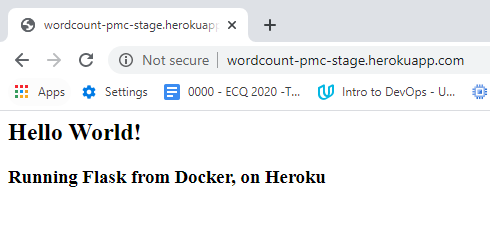
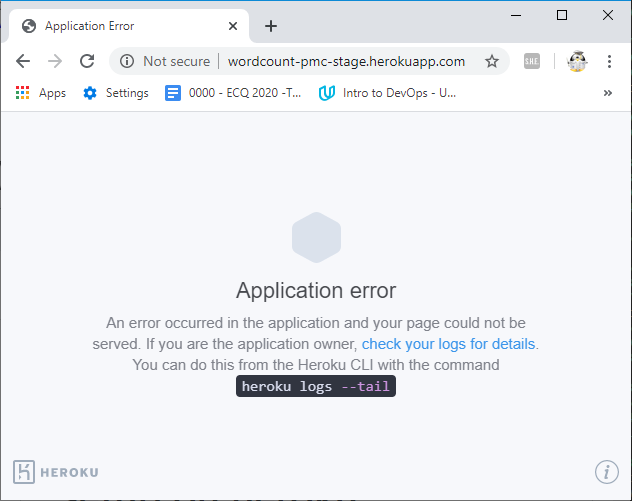

# setup on heroku
may not need all of this (git repos) as I am using a container

ref 
* https://devcenter.heroku.com/articles/heroku-cli-commands
* https://devcenter.heroku.com/articles/container-registry-and-runtime
* https://medium.com/@ksashok/containerise-your-python-flask-using-docker-and-deploy-it-onto-heroku-a0b48d025e43

* shakespeare [ec](https://github.com/campbe13/docker-ecq2020/tree/master/shakespeare-ec)
* shakespeare [jm](https://github.com/campbe13/docker-ecq2020/tree/master/shakespeare-jm)


omit git push to heroku
1. [create](#create) heroku apps (prod & stage) 
2. [build](#build)  build the container
3. [run](#run) run the container locally 
3. [publish to heroku](#publish-to-heroku) push the container
4. working [try it via browser and check logs](#try-it-track-it-working)  http://wordcount-pmc-stage.herokuapps.com 
5. before the fix, errors: [try it via browser and check logs](#try-it-track-it-before-fix)

__Note:__  I had problems running the container on heroku. It worked when I ran the container locally but it kept crashing when I pushed and ran on heroku, the fix was in the app:
```
port = int(os.environ.get("PORT", 5000))
# when I run the app
    app.run(host="0.0.0.0",debug=True, port=port)
```
If this is not used the app crashes

__Note:__  No need to forward the port on heroku it is done automatically & this uses http not https.
 

## create
ensure the task stack is container
``` 
tricia@acerubuntu1804:~/ecq/flaskpy-travis$ heroku stack:set container -a wordcount-pmc-stage
    Warning: heroku update available from 7.39.0 to 7.39.6.
Setting stack to container... done
tricia@acerubuntu1804:~/ecq/flaskpy-travis$ heroku apps:info --app wordcount-pmc-stae
    Warning: heroku update available from 7.39.0 to 7.39.6.
 ▸    Couldn't find that app.
tricia@acerubuntu1804:~/ecq/flaskpy-travis$ heroku apps:info --app wordcount-pmc-stage
    Warning: heroku update available from 7.39.0 to 7.39.6.
=== wordcount-pmc-stage
Auto Cert Mgmt: false
Dynos:
Git URL:        https://git.heroku.com/wordcount-pmc-stage.git
Owner:          pcampbell.edu@gmail.com
Region:         us
Repo Size:      0 B
Slug Size:      0 B
Stack:          container
Web URL:        https://wordcount-pmc-stage.herokuapp.com/
tricia@acerubuntu1804:~/ecq/flaskpy-travis$ heroku stack:set container -a wordcount-pmc-prod
    Warning: heroku update available from 7.39.0 to 7.39.6.
Setting stack to container... done
tricia@acerubuntu1804:~/ecq/flaskpy-travis$ ^C
```
## create & set type test
problem default stack is heroku-18, need container
```
tricia@acerubuntu1804:~/ecq/flaskpy-travis$ heroku create --app wordcount-pmc-cont ^C
tricia@acerubuntu1804:~/ecq/flaskpy-travis$ heroku apps:info --app wordcount-pmc-cont
    Warning: heroku update available from 7.39.0 to 7.39.6.
=== wordcount-pmc-cont
Auto Cert Mgmt: false
Dynos:
Git URL:        https://git.heroku.com/wordcount-pmc-cont.git
Owner:          pcampbell.edu@gmail.com
Region:         us
Repo Size:      0 B
Slug Size:      0 B
Stack:          heroku-18
Web URL:        https://wordcount-pmc-cont.herokuapp.com/
tricia@acerubuntu1804:~/ecq/flaskpy-travis$ heroku apps:destroy wordcount-pmc-cont
    Warning: heroku update available from 7.39.0 to 7.39.6.
 ▸    WARNING: This will delete ⬢ wordcount-pmc-cont including all add-ons.
 ▸    To proceed, type wordcount-pmc-cont or re-run this command with --confirm
 ▸    wordcount-pmc-cont

> wordcount-pmc-cont
Destroying ⬢ wordcount-pmc-cont (including all add-ons)... done
tricia@acerubuntu1804:~/ecq/flaskpy-travis$ heroku apps:create  wordcount-pmc-cont --stack=container
    Warning: heroku update available from 7.39.0 to 7.39.6.
Creating ⬢ wordcount-pmc-cont... done, stack is container
https://wordcount-pmc-cont.herokuapp.com/ | https://git.heroku.com/wordcount-pmc-cont.git
tricia@acerubuntu1804:~/ecq/flaskpy-travis$ heroku apps:info --app wordcount-pmc-cont
    Warning: heroku update available from 7.39.0 to 7.39.6.
=== wordcount-pmc-cont
Auto Cert Mgmt: false
Dynos:
Git URL:        https://git.heroku.com/wordcount-pmc-cont.git
Owner:          pcampbell.edu@gmail.com
Region:         us
Repo Size:      0 B
Slug Size:      0 B
Stack:          container
Web URL:        https://wordcount-pmc-cont.herokuapp.com/
tricia@acerubuntu1804:~/ecq/flaskpy-travis$
```

## build
```
tricia@acerubuntu1804:~/ecq/flaskpy-travis$ make build
docker build -t flastpytravis .
Sending build context to Docker daemon  52.22kB
Step 1/7 : FROM python:3-alpine
 ---> 6c32e2504283
Step 2/7 : MAINTAINER P.M.Campbell pcampbell.edu@gmail.com
 ---> Using cache
 ---> c68d29cf55af
Step 3/7 : RUN pip install --no-cache-dir Flask
 ---> Using cache
 ---> f3893f9e5fe5
Step 4/7 : COPY app.py /usr/local/bin/app.py
 ---> 5010bbc7fef4
Step 5/7 : EXPOSE 5000
 ---> Running in 758938c7259f
Removing intermediate container 758938c7259f
 ---> 9fa1053f02fe
Step 6/7 : WORKDIR /usr/local/bin
 ---> Running in 58681c8b0ae3
Removing intermediate container 58681c8b0ae3
 ---> ee879e17f102
Step 7/7 : CMD [ "python", "./app.py" ]
 ---> Running in 036ee453419c
Removing intermediate container 036ee453419c
 ---> ee94387fd117
Successfully built ee94387fd117
Successfully tagged flastpytravis:latest
```
## run
```
docker run -d -p 5555:5000    --name flastpytravis  flastpytravis
docker ps
182443517a1dd1f7ff0acf6d256a4089bb9d5aaec6cf14a4db646e1c09f65dec
CONTAINER ID        IMAGE               COMMAND             CREATED             STATUS                  PORTS                   NAMES
182443517a1d        flastpytravis       "python ./app.py"   5 seconds ago       Up Less than a second   0.0.0.0:5555->5000/tcp   flastpytravis
```
# publish to heroku
```
tricia@acerubuntu1804:~/ecq/flaskpy-travis$ make heroku-publish
push to the heroku repo
    Warning: heroku update available from 7.39.0 to 7.39.6.
=== Building web (/home/tricia/ecq/flaskpy-travis/Dockerfile)
Sending build context to Docker daemon  54.27kB
Step 1/7 : FROM python:3-alpine
 ---> 6c32e2504283
Step 2/7 : MAINTAINER P.M.Campbell pcampbell.edu@gmail.com
 ---> Using cache
 ---> c68d29cf55af
Step 3/7 : RUN pip install --no-cache-dir Flask
 ---> Using cache
 ---> f3893f9e5fe5
Step 4/7 : COPY app.py /usr/local/bin/app.py
 ---> Using cache
 ---> 5010bbc7fef4
Step 5/7 : EXPOSE 5000
 ---> Using cache
 ---> 9fa1053f02fe
Step 6/7 : WORKDIR /usr/local/bin
 ---> Using cache
 ---> ee879e17f102
Step 7/7 : CMD [ "python", "./app.py" ]
 ---> Using cache
 ---> ee94387fd117
Successfully built ee94387fd117
Successfully tagged registry.heroku.com/wordcount-pmc-stage/web:latest
=== Pushing web (/home/tricia/ecq/flaskpy-travis/Dockerfile)
The push refers to repository [registry.heroku.com/wordcount-pmc-stage/web]
f76ef2309f43: Layer already exists
c94e70d31b77: Layer already exists
49462667bf1d: Layer already exists
95d0dbe061b1: Layer already exists
992ca7b80035: Layer already exists
a539b76feca4: Pushed
3e207b409db3: Pushed
latest: digest: sha256:2e202790b74965f476aca505908577d9d47a396b79afdc216e568efd41f7b802 size: 1786
Your image has been successfully pushed. You can now release it with the 'container:release' command.
release app
    Warning: heroku update available from 7.39.0 to 7.39.6.
    Error: Flag --app expects a value
if the last step worked load https://wordcount-pmc-stage.herokuapp.com in a browser
tricia@acerubuntu1804:~/ecq/flaskpy-travis$
```
## try it track it working   

```
tricia@acerubuntu1804:~/ecq/flaskpy-travis$ heroku logs --tail --app wordcount-pmc-stage
...
2020-05-04T20:53:37.292055+00:00 app[api]: Release v9 created by user pcampbell.edu@gmail.com
2020-05-04T20:53:37.292055+00:00 app[api]: Deployed web (e6f5e636a593) by user pcampbell.edu@gmail.com
2020-05-04T20:53:43.069593+00:00 heroku[web.1]: State changed from starting to up
2020-05-04T20:53:42.996214+00:00 app[web.1]: * Serving Flask app "app" (lazy loading)
2020-05-04T20:53:42.996229+00:00 app[web.1]: * Environment: production
2020-05-04T20:53:42.996265+00:00 app[web.1]: WARNING: Do not use the development server in a production environment.
2020-05-04T20:53:42.996299+00:00 app[web.1]: Use a production WSGI server instead.
2020-05-04T20:53:42.996357+00:00 app[web.1]: * Debug mode: on
2020-05-04T20:53:43.006416+00:00 app[web.1]: * Running on http://0.0.0.0:48527/ (Press CTRL+C to quit)
2020-05-04T20:53:43.007092+00:00 app[web.1]: * Restarting with stat
2020-05-04T20:53:43.257737+00:00 app[web.1]: * Debugger is active!
2020-05-04T20:53:43.258226+00:00 app[web.1]: * Debugger PIN: 196-529-964
2020-05-04T20:55:43.437880+00:00 heroku[router]: at=info method=GET path="/" host=wordcount-pmc-stage.herokuapp.com request_id=c1367255-d7cd-4437-97d2-ff4fd1039372 fwd="107.179.147.128" dyno=web.1 connect=0ms service=6ms status=200 bytes=234 protocol=http
2020-05-04T20:55:43.435271+00:00 app[web.1]: 10.30.235.17 - - [04/May/2020 20:55:43] "GET / HTTP/1.1" 200 -
```
## try it track it before fix
problems crashes


```
tricia@acerubuntu1804:~/ecq/flaskpy-travis$ heroku logs --tail --app wordcount-pmc-stage
...
2020-05-04T18:16:24.993751+00:00 heroku[web.1]: State changed from crashed to starting
2020-05-04T18:16:31.511559+00:00 app[web.1]: * Serving Flask app "app" (lazy loading)
2020-05-04T18:16:31.511587+00:00 app[web.1]: * Environment: production
2020-05-04T18:16:31.511676+00:00 app[web.1]: WARNING: This is a development server. Do not use it in a production deployment.
2020-05-04T18:16:31.511752+00:00 app[web.1]: Use a production WSGI server instead.
2020-05-04T18:16:31.511809+00:00 app[web.1]: * Debug mode: on
2020-05-04T18:16:31.527085+00:00 app[web.1]: * Running on http://0.0.0.0:5000/ (Press CTRL+C to quit)
2020-05-04T18:16:31.528285+00:00 app[web.1]: * Restarting with stat
2020-05-04T18:16:31.742350+00:00 app[web.1]: * Debugger is active!
2020-05-04T18:16:31.742844+00:00 app[web.1]: * Debugger PIN: 221-533-909
2020-05-04T18:17:28.845410+00:00 heroku[web.1]: State changed from starting to crashed
2020-05-04T19:19:10.333587+00:00 heroku[router]: at=error code=H10 desc="App crashed" method=GET path="/" host=wordcount-pmc-stage.herokuapp.com request_id=bb381c9f-4552-463a-9c93-0389d6c0583a fwd="107.179.147.128" dyno= connect= service= status=503 bytes= protocol=http
2020-05-04T19:19:10.509030+00:00 heroku[router]: at=error code=H10 desc="App crashed" method=GET path="/favicon.ico" host=wordcount-pmc-stage.herokuapp.com request_id=1a86169f-8dde-475f-b4ae-614011cfa66d fwd="107.179.147.128" dyno= connect= service= status=503 bytes= protocol=http
```

